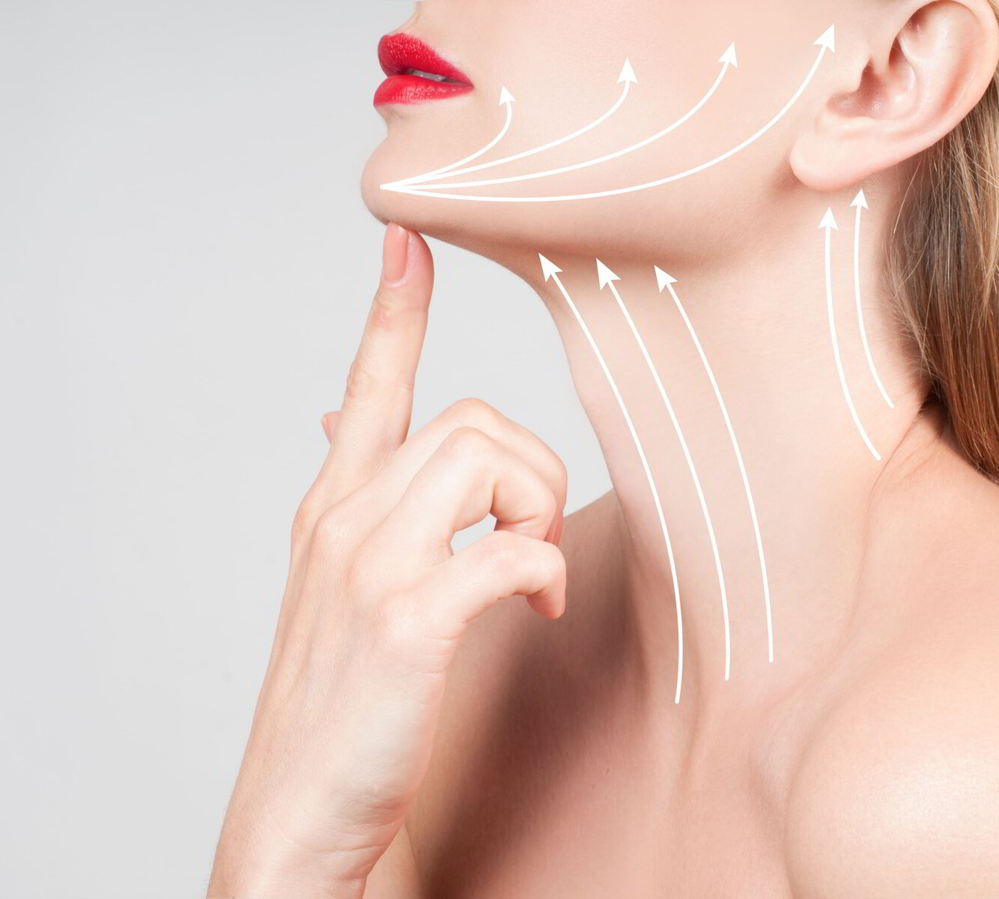

  

    

      <svg class="hidden xl:block absolute right-0 inset-y-0 h-full w-48 text-white transform translate-x-1/2" fill="currentColor" viewBox="0 0 100 100" preserveAspectRatio="none" aria-hidden="true">
        <polygon points="50,0 100,0 50,100 0,100" />
      </svg>

      

        <nav class="relative flex items-baseline" aria-label="Global">
          

            
          

          
Medicina Estética

        </nav>
      

      <main class="mt-10 mx-auto max-w-2xl px-4 sm:mt-12 sm:px-6 md:mt-16 lg:mt-20 lg:px-8 xl:mt-28">
        

          <h1 class="text-3xl tracking-tight font-extrabold text-gray-900 sm:text-5xl">
            Bioestimuladores promueven
            mejoría gradual y natural
            de la piel
            sin cambiar la expresión facial.
          </h1>
          

            Elimina las arrugas y mejora la firmeza de tu piel con Profhilo: el
            tratamiento líder en bioestimulación de colágeno y elastina. Resultados
            duraderos y naturales. Ideal para rostro, cuello y manos.
          

          

              <a href="#faq" class="px-6 py-3 text-lg font-medium rounded-md shadow-sm text-white bg-rose">
                Saber más
              </a>
            <button class="px-6 py-3 text-lg font-medium rounded-md shadow-sm text-white bg-green-500"
              onclick="checkout({ contents: [{ id: 'profhilo', quantity: 1 }] }, true)"
            >
              Pedir cita
            </button>
          

        

      </main>
    

  

  

    
  

  

    

      <h2 class="font-semibold text-rose uppercase
        tracking-wide">TECNOLOGÍA en bioestimuladores</h2>
      <h2 class="text-3xl font-extrabold text-coal mt-4">
        Actúa en diferentes dianas en la misma sesión
      </h2>
    

    <dl class="space-y-10 lg:space-y-0 lg:grid lg:grid-cols-3 lg:gap-16">
      

        

          <dt class="text-2xl mb-4 leading-6 font-medium text-rose">
            Hidratación Cutánea
          </dt>
          <dd class="prose md:prose-lg mt-2 text-iron">
            Profhilo tiene una alta concentración de ácido hialurónico, lo
            que ayuda a retener la humedad en la piel, mejorando significativamente
            su hidratación y aportando un aspecto más fresco y saludable.
          </dd>
        

      

      

        

          <dt class="text-2xl mb-4 leading-6 font-medium text-rose">
            Producción de Colágeno y Elastina
          </dt>
          <dd class="prose md:prose-lg mt-2 text-iron">
            Al promover la síntesis de colágeno y elastina, los bioestimuladores
            contribuyen a mejorar la elasticidad y firmeza de la piel, reduciendo la
            flacidez y dando un aspecto más juvenil.
          </dd>
        

      

      

        

          <dt class="text-2xl mb-4 leading-6 font-medium text-rose">
            Efectividad y Seguridad
          </dt>
          <dd class="prose md:prose-lg mt-2 text-iron">
            El tratamiento no requiere tiempo de inactividad significativo,
            permitiendo a los pacientes volver rápidamente a sus actividades
            diarias, con efectos secundarios mínimos que desaparecen rápidamente.
          </dd>
        

      

    </dl>

  

  

    

      <h2 class="font-semibold text-rose uppercase
        tracking-wide">Nuestro diferencial</h2>
    

    <dl class="lg:grid lg:grid-cols-2 lg:px-8">
      
      

        

          En Dermábile todos los protocolos médicos son personalizados y
          diseñados por la Dra. Vanessa Martins, respetando la
          individualidad de cada paciente. Además del seguimiento del
          tratamiento, garantizando atención y soporte  antes, 
          durante, y después de los procedimientos.
        

        

          Nuestros protocolos multi-tratamientos de asociación con otras
          tecnologías proporcionan resultados superiores, con más
          seguridad y aspectos naturales.
        

      

    </dl>
  

  

    

      <h2 class="font-semibold text-rose uppercase tracking-wide" id="faq">Opiniones</h2>
    

    

      <figure class="rounded-md bg-white p-6 shadow ring-1 ring-gray-200">
        

          <i class="fa fa-star"></i>
          <i class="fa fa-star"></i>
          <i class="fa fa-star"></i>
          <i class="fa fa-star"></i>
          <i class="fa fa-star"></i>
        

        <blockquote class="text-gray-900 text-sm leading-6">
          Localización 10/10, consulta completa y linda (aparatos,
          recepción, sala de procedimientos) y lo más importante, el trato
          y servicio, es increíble la sensibilidad, profesionalismo y
          cuidado tanto de Dr Vanesa como también de Ana, su mano derecha
          que nos ayuda desde citarnos, apoyar en los procedimientos y
          hacernos seguimiento pos consulta. Recomiendo 100%.
        </blockquote>
        <figcaption class="mt-6 flex justify-end gap-x-4">
          

            Ana V. B.
          

        </figcaption>
      </figure>

      <figure class="rounded-md bg-white p-6 shadow ring-1 ring-gray-200">
        

          <i class="fa fa-star"></i>
          <i class="fa fa-star"></i>
          <i class="fa fa-star"></i>
          <i class="fa fa-star"></i>
          <i class="fa fa-star"></i>
        

        <blockquote class="text-gray-900 text-sm leading-6">
          The doctor is extremely competent and really help me solve my problem
          in a safe and attentive way and the staff of the center was extremely
          kind and available also for follow-ups and additional checks. I would
          highly recommend the doctor, the staff, and the treatments they use
          because they are state of the arts, highly professional and with a
          great human touch.
        </blockquote>
        <figcaption class="mt-6 flex justify-end gap-x-4">
          

            Irene P.
          

        </figcaption>
      </figure>

      <figure class="rounded-md bg-white p-6 shadow ring-1 ring-gray-200">
        

          <i class="fa fa-star"></i>
          <i class="fa fa-star"></i>
          <i class="fa fa-star"></i>
          <i class="fa fa-star"></i>
          <i class="fa fa-star"></i>
        

        <blockquote class="text-gray-900 text-sm leading-6">
          Lo mejor de este centro es que te aconsejan que es lo que realmente
          te va bien con la harmonía de tu anatomía facial. He visitado otras
          clínicas estéticas que por vender me han destrozado la cara. La Dra
          Martins, con cariño y empatía me ha tratado de manera holística y ahora
          puedo decir que me siento mejor conmigo mismo (a nivel físico y
          emocional). Lo recomiendo sin lugar a duda :)
        </blockquote>
        <figcaption class="mt-6 flex justify-end gap-x-4">
          

            Ricardo B. N.
          

        </figcaption>
      </figure>

    

  

  

    

      <h2 class="font-semibold text-rose uppercase
        tracking-wide" id="faq">PREGUNTAS FRECUENTES</h2>
    

    <dl class="max-w-3xl mx-auto px-4 space-y-6 divide-y divide-gray-200">
      

        <dt class="prose md:prose-xl">
          <button type="button" class="text-left w-full flex justify-between items-start text-gray-400 focus:outline-none" x-on:click="open = !open">
            
              ¿Cuánto tarda un tratamiento con bioestimuladores?
            
            
              <svg x-bind:class="open ? '-rotate-180' : 'rotate-0'" class="rotate-0 h-6 w-6 transform" xmlns="http://www.w3.org/2000/svg" fill="none" viewBox="0 0 24 24" stroke="currentColor" aria-hidden="true">
                <path stroke-linecap="round" stroke-linejoin="round" stroke-width="2" d="M19 9l-7 7-7-7" />
              </svg>
            
          </button>
        </dt>
        <dd class="mt-2" x-bind:class="{ hidden: !open }">
          

            Una sesión suele tardar unos 30 minutos.
          

        </dd>
      

      

        <dt class="prose md:prose-xl">
          <button type="button" class="text-left w-full flex justify-between items-start text-gray-400 focus:outline-none" x-on:click="open = !open">
            
              ¿Es doloroso?
            
            
              <svg x-bind:class="open ? '-rotate-180' : 'rotate-0'" class="rotate-0 h-6 w-6 transform" xmlns="http://www.w3.org/2000/svg" fill="none" viewBox="0 0 24 24" stroke="currentColor" aria-hidden="true">
                <path stroke-linecap="round" stroke-linejoin="round" stroke-width="2" d="M19 9l-7 7-7-7" />
              </svg>
            
          </button>
        </dt>
        <dd class="mt-2" x-bind:class="{ hidden: !open }">
          

            Las inyecciones son generalmente bien toleradas y no
            causan dolor significativo. Sin embargo, algunos pacientes pueden
            experimentar molestias leves o hematomas en el lugar de la inyección.
          

        </dd>
      

      

        <dt class="prose md:prose-xl">
          <button type="button" class="text-left w-full flex justify-between items-start text-gray-400 focus:outline-none" x-on:click="open = !open">
            
              ¿Cuántas sesiones son necesarias?
            
            
              <svg x-bind:class="open ? '-rotate-180' : 'rotate-0'" class="rotate-0 h-6 w-6 transform" xmlns="http://www.w3.org/2000/svg" fill="none" viewBox="0 0 24 24" stroke="currentColor" aria-hidden="true">
                <path stroke-linecap="round" stroke-linejoin="round" stroke-width="2" d="M19 9l-7 7-7-7" />
              </svg>
            
          </button>
        </dt>
        <dd class="mt-2" x-bind:class="{ hidden: !open }">
          

            La mayoría de los pacientes necesitan dos tratamientos con
            con un intervalo de cuatro semanas para lograr resultados
            óptimos.
          

        </dd>
      

      

        <dt class="prose md:prose-xl">
          <button type="button" class="text-left w-full flex justify-between items-start text-gray-400 focus:outline-none" x-on:click="open = !open">
            
              ¿Cuánto duran los resultados?
            
            
              <svg x-bind:class="open ? '-rotate-180' : 'rotate-0'" class="rotate-0 h-6 w-6 transform" xmlns="http://www.w3.org/2000/svg" fill="none" viewBox="0 0 24 24" stroke="currentColor" aria-hidden="true">
                <path stroke-linecap="round" stroke-linejoin="round" stroke-width="2" d="M19 9l-7 7-7-7" />
              </svg>
            
          </button>
        </dt>
        <dd class="mt-2" x-bind:class="{ hidden: !open }">
          

            Los resultados pueden durar hasta seis meses o más, dependiendo de cada paciente y de su tipo de piel.
          

        </dd>
      

      

        <dt class="prose md:prose-xl">
          <button type="button" class="text-left w-full flex justify-between items-start text-gray-400 focus:outline-none" x-on:click="open = !open">
            
              ¿Tiene efectos secundarios?
            
            
              <svg x-bind:class="open ? '-rotate-180' : 'rotate-0'" class="rotate-0 h-6 w-6 transform" xmlns="http://www.w3.org/2000/svg" fill="none" viewBox="0 0 24 24" stroke="currentColor" aria-hidden="true">
                <path stroke-linecap="round" stroke-linejoin="round" stroke-width="2" d="M19 9l-7 7-7-7" />
              </svg>
            
          </button>
        </dt>
        <dd class="mt-2" x-bind:class="{ hidden: !open }">
          

            Los efectos secundarios más comunes son hinchazón leve,
            enrojecimiento y hematomas en el lugar de la inyección que suelen
            desaparecer a los pocos días.
          

        </dd>
      

    </dl>
  

  

    Para saber más, contacta con nosotros
  

  

    <a href="https://wa.me/34931770530" class="px-6 py-3 border
             border-transparent text-lg font-medium text-center
      rounded-md shadow-sm text-white bg-green-500 
      focus:outline-none my-2 md:my-0"
      onclick="checkout({ contents: [{ id: 'profhilo', quantity: 1 }] })"
    >
      <i class="fab fa-whatsapp mr-2"></i> 931 770 530
    </a>
    <a href="tel:931770530" class="px-6 py-3 text-center
      border border-transparent text-lg font-medium rounded-md shadow-sm text-black bg-gray-300 focus:outline-none my-2 md:my-0"
      onclick="checkout({ contents: [{ id: 'profhilo', quantity: 1 }] })"
    >
      <i class="fal fa-phone-office mr-2"></i> 931 770 530
    </a>
    <button class="px-6 py-3
      border border-transparent text-lg font-medium rounded-md shadow-sm
      text-white bg-rose focus:outline-none my-2 md:my-0"
      onclick="checkout({ contents: [{ id: 'profhilo', quantity: 1 }] }, true)"
    >
      <i class="fas fa-comments mr-2"></i> Chat
    </button>
  

