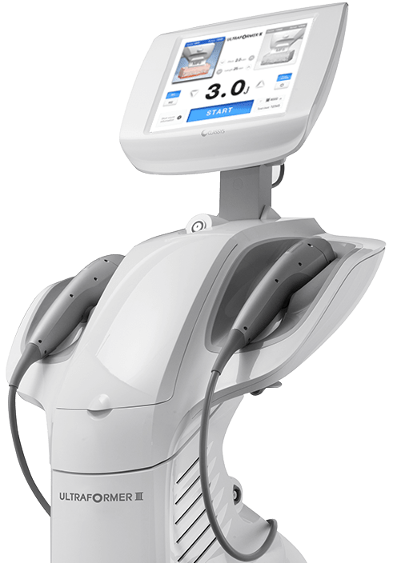
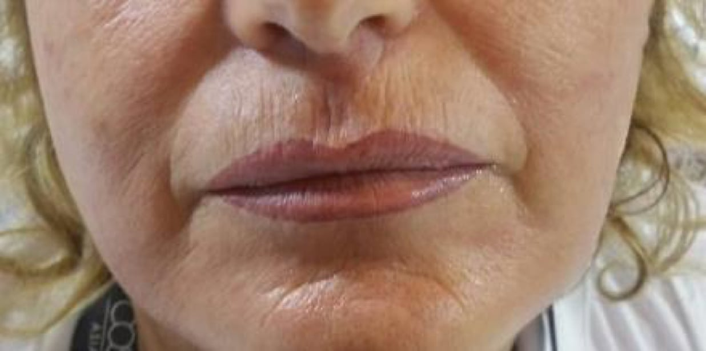
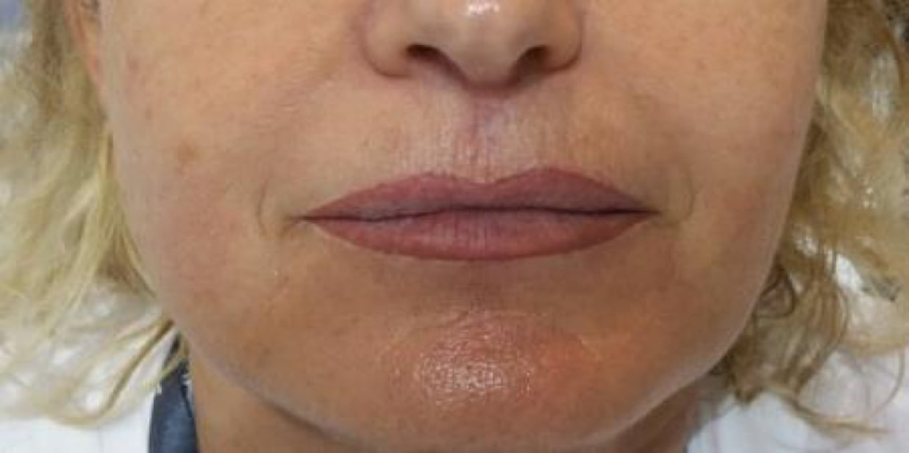
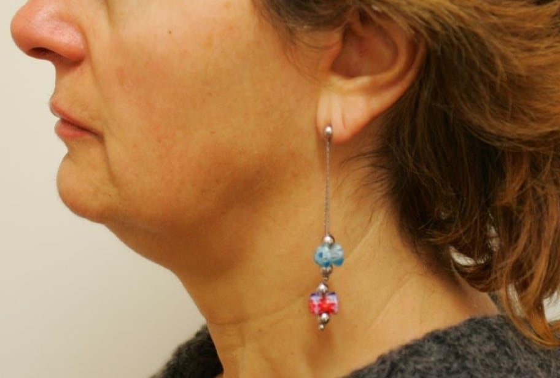
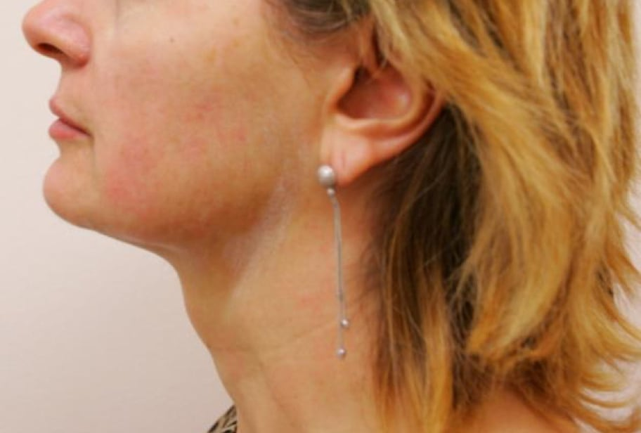
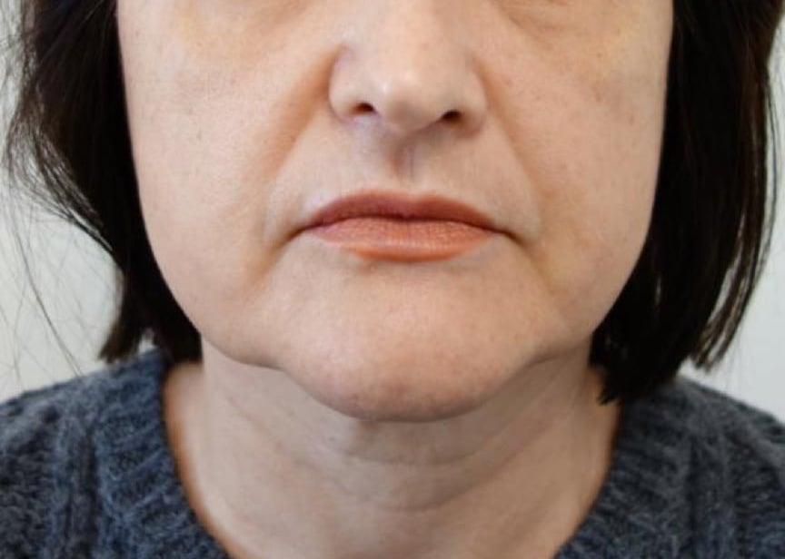

  

    

      <svg class="hidden lg:block absolute right-0 inset-y-0 h-full w-48 text-white transform translate-x-1/2" fill="currentColor" viewBox="0 0 100 100" preserveAspectRatio="none" aria-hidden="true">
        <polygon points="50,0 100,0 50,100 0,100"></polygon>
      </svg>

      

        <nav class="relative flex items-baseline" aria-label="Global">
          

            
          

          
Medicina Estética

        </nav>
      

      <main class="mt-10 mx-auto max-w-2xl px-4 sm:mt-12 sm:px-6 md:mt-16 lg:mt-20 lg:px-8 xl:mt-28">
        

          <h1 class="text-3xl tracking-tight font-extrabold text-gray-900 sm:text-5xl">
            Combate la flacidez y reafirma tu piel
            con
            
              lifting facial sin cirugía
            
          </h1>
          

            Estimula la producción de colágeno y recupera la tersura de tu piel
            con la tecnología más moderna del mercado: el ultrasonido micro y
            macro focalizado de alta intensidad (HIFU) de Ultraformer III.
          

          

            

              <button class="w-full flex items-center justify-center
                px-8 py-3 border border-transparent font-medium rounded-md
                text-white bg-rose md:py-4 md:text-lg md:px-10"
                onclick="checkout({ contents: [{ id: 'ultraformer', quantity: 1 }] }, true)">
                Pedir cita
              </button>
            

          

        

      </main>
    

  

  

    
  

  <video
    class="w-full md:w-4/5 h-auto appearance-none mx-auto relative"
    poster="ultraformer-poster.jpg"
    controls
    preload="auto"
  >
    <source src="https://dermabile.s3.amazonaws.com/assets/ultraformer.webm" type="video/webm" />
    <source src="https://dermabile.s3.amazonaws.com/assets/ultraformer.mp4" type="video/mp4" />
  </video>

  

    

      <h2 class="font-semibold text-rose uppercase
        tracking-wide mb-2">LOS RESULTADOS — TU PIEL TERSA Y JOVEN</h2>
    

    

      

        

          
          
        

      

      

        

          
          
        

      

      

        

          
          
        

      

      

        <button type="button" class="inline-flex items-center px-2.5 py-1.5 border font-medium rounded shadow-sm hover:bg-peach hover:text-white" x-bind:class="set == 1 ? 'border-transparent bg-rose text-white' : 'border-gray-300 bg-transparent text-gray-700'" x-on:click="set = 1">
          Arrugas finas
          1
        </button>
        <button type="button" class="inline-flex items-center px-2.5 py-1.5 border font-medium rounded shadow-sm hover:bg-peach hover:text-white" x-bind:class="set == 2 ? 'border-transparent bg-rose text-white' : 'border-gray-300 bg-transparent text-gray-700'" x-on:click="set = 2">
          Contorno mandibular
          2
        </button>
        <button type="button" class="inline-flex items-center px-2.5 py-1.5 border font-medium rounded shadow-sm hover:bg-peach hover:text-white" x-bind:class="set == 3 ? 'border-transparent bg-rose text-white' : 'border-gray-300 bg-transparent text-gray-700'" x-on:click="set = 3">
          Lineas de
          expresión 
          3
        </button>
      

    

  

  

    

      <h2 class="font-semibold text-rose uppercase
        tracking-wide mb-2">LIFTING FACIAL SIN CIRUGÍA</h2>
    

    <dl class="space-y-10 lg:space-y-0 lg:grid lg:grid-cols-2 lg:gap-8">
      

        <dt>
          

            <i class="fa fa-feather-alt"></i>
          

          
Mínimamente invasivo

        </dt>
        <dd class="mt-2 prose md:prose-lg text-gray-500">
          Estimula la producción de tu propio colágeno, sin agujas o uso de
          sustancias externas. 
        </dd>
      

      

        <dt>
          

            <i class="fa fa-walking"></i>
          

          
No
          downtime

        </dt>
        <dd class="mt-2 prose md:prose-lg text-gray-500">
          El Ultraformer trata las capas profundas y mantiene la superficie de
          la piel integra. Se puede hacer en cualquier época del año.
        </dd>
      

      

        <dt>
          

            <i class="fa fa-calendar"></i>
          

          
Cualquier
          época del año

        </dt>
        <dd class="mt-2 prose md:prose-lg text-gray-500">
          Incorporación inmediata a las actividades habituales, con mínimos
          cuidados pos tratamiento.
        </dd>
      

      

        <dt>
          

            <i class="fa fa-shapes"></i>
          

          

            Cualquier tipo de piel
          

        </dt>
        <dd class="mt-2 prose md:prose-lg text-gray-500">
          La aplicación del HIFU es seguro en pacientes de piel oscura o
          bronceada.
        </dd>
      

    </dl>
  

  

    

      <h2 class="font-semibold text-rose uppercase
        tracking-wide">Nuestro diferencial</h2>
    

    <dl class="md:grid md:grid-cols-2 md:px-8">
      
      

        

          En Dermábile todos los protocolos médicos son diseñados y realizados
          por la Dra. Vanessa Martins, además del seguimiento del tratamiento,
          garantizando atención y soporte a los pacientes antes, durante, y
          después de los procedimientos.
        

        

          Juntamente con el Ultraformer, nuestros protocolos multi-tratamientos
          de asociación con bioestimuladores proporcionan resultados superiores,
          con más seguridad y aspectos naturales
        

      

    </dl>
  

  

    

      <h2 class="font-semibold text-rose uppercase
        tracking-wide">PREGUNTAS FRECUENTES</h2>
    

    <dl class="max-w-3xl mx-auto px-4 space-y-6 divide-y divide-gray-200">
      

        <dt class="prose md:prose-xl">
          <button type="button" class="text-left w-full flex justify-between items-start text-gray-400 focus:outline-none" x-on:click="open = !open">
            
              ¿Cómo funciona el Ultraformer?
            
            
              <svg x-bind:class="open ? '-rotate-180' : 'rotate-0'" class="rotate-0 h-6 w-6 transform" xmlns="http://www.w3.org/2000/svg" fill="none" viewBox="0 0 24 24" stroke="currentColor" aria-hidden="true">
                <path stroke-linecap="round" stroke-linejoin="round" stroke-width="2" d="M19 9l-7 7-7-7" />
              </svg>
            
          </button>
        </dt>
        <dd class="mt-2" x-bind:class="{ hidden: !open }">
          

            El Ultraformer libera en la piel la energía conocida como
            ultrasonido focalizado de alta intensidad (HIFU). La energía del
            HIFU  es capaz de penetrar la piel y llegar a capas profundas,
            calentando las fibras de colágeno y produciendo puntos de
            microcoagulación. Eso hace con que estas fibras de colágeno estén
            más tersas y gruesas, produciendo un efecto de mayor firmeza de la
            piel. 
          

        </dd>
      

      

        <dt class="prose md:prose-xl">
          <button type="button" class="text-left w-full flex justify-between items-start text-gray-400 focus:outline-none" x-on:click="open = !open">
            
              ¿Hay contraindicaciones?
            
            
              <svg x-bind:class="open ? '-rotate-180' : 'rotate-0'" class="rotate-0 h-6 w-6 transform" xmlns="http://www.w3.org/2000/svg" fill="none" viewBox="0 0 24 24" stroke="currentColor" aria-hidden="true">
                <path stroke-linecap="round" stroke-linejoin="round" stroke-width="2" d="M19 9l-7 7-7-7" />
              </svg>
            
          </button>
        </dt>
        <dd class="mt-2" x-bind:class="{ hidden: !open }">
          

            Las contraindicaciones incluyen pacientes embarazadas, con heridas
            abiertas, con prótesis metálicas en la zona a tratar y con uso de
            marcapaso.  
          

        </dd>
      

      

        <dt class="prose md:prose-xl">
          <button type="button" class="text-left w-full flex justify-between items-start text-gray-400 focus:outline-none" x-on:click="open = !open">
            
              ¿El tratamiento es doloroso?
            
            
              <svg x-bind:class="open ? '-rotate-180' : 'rotate-0'" class="rotate-0 h-6 w-6 transform" xmlns="http://www.w3.org/2000/svg" fill="none" viewBox="0 0 24 24" stroke="currentColor" aria-hidden="true">
                <path stroke-linecap="round" stroke-linejoin="round" stroke-width="2" d="M19 9l-7 7-7-7" />
              </svg>
            
          </button>
        </dt>
        <dd class="mt-2" x-bind:class="{ hidden: !open }">
          

            Se puede experimentar un dolor mínimo o una ligera molestia en el
            área tratado, aunque las sensaciones desaparecen rápidamente
            inmediatamente después del tratamiento.
          

        </dd>
      

      

        <dt class="prose md:prose-xl">
          <button type="button" class="text-left w-full flex justify-between items-start text-gray-400 focus:outline-none" x-on:click="open = !open">
            
              ¿Existen efectos secundarios?
            
            
              <svg x-bind:class="open ? '-rotate-180' : 'rotate-0'" class="rotate-0 h-6 w-6 transform" xmlns="http://www.w3.org/2000/svg" fill="none" viewBox="0 0 24 24" stroke="currentColor" aria-hidden="true">
                <path stroke-linecap="round" stroke-linejoin="round" stroke-width="2" d="M19 9l-7 7-7-7" />
              </svg>
            
          </button>
        </dt>
        <dd class="mt-2" x-bind:class="{ hidden: !open }">
          

            Se puede experimentar un ligero enrojecimiento durante unas horas,
            así como hormigueo o hinchazón en las áreas tratadas durante unas
            pocas semanas. Excepcionalmente también pueden aparecer moretones y
            adormecimiento que suelen desaparecer de 2 a 4 semanas después del
            tratamiento.
          

        </dd>
      

      

        <dt class="prose md:prose-xl">
          <button type="button" class="text-left w-full flex justify-between items-start text-gray-400 focus:outline-none" x-on:click="open = !open">
            
              ¿Cuánto tiempo dura la sesión?
            
            
              <svg x-bind:class="open ? '-rotate-180' : 'rotate-0'" class="rotate-0 h-6 w-6 transform" xmlns="http://www.w3.org/2000/svg" fill="none" viewBox="0 0 24 24" stroke="currentColor" aria-hidden="true">
                <path stroke-linecap="round" stroke-linejoin="round" stroke-width="2" d="M19 9l-7 7-7-7" />
              </svg>
            
          </button>
        </dt>
        <dd class="mt-2" x-bind:class="{ hidden: !open }">
          

            El tiempo de la sesión depende de las zonas que vamos a tratar,
            normalmente 30 minutos para pequeñas zonas y aproximadamente 1 hora
            para cara completa.  
          

        </dd>
      

      

        <dt class="prose md:prose-xl">
          <button type="button" class="text-left w-full flex justify-between items-start text-gray-400 focus:outline-none" x-on:click="open = !open">
            
              ¿Cuántas sesiones son necesarias?
            
            
              <svg x-bind:class="open ? '-rotate-180' : 'rotate-0'" class="rotate-0 h-6 w-6 transform" xmlns="http://www.w3.org/2000/svg" fill="none" viewBox="0 0 24 24" stroke="currentColor" aria-hidden="true">
                <path stroke-linecap="round" stroke-linejoin="round" stroke-width="2" d="M19 9l-7 7-7-7" />
              </svg>
            
          </button>
        </dt>
        <dd class="mt-2" x-bind:class="{ hidden: !open }">
          

            De una manera general, para pacientes con flacidez inicial apenas
            una sesión es necesaria, con sesiones de mantenimiento a cada 12
            meses.  Para flacidez moderada, 2-3 tratamientos son recomendados y
            mantenimientos con intervalos de 6 meses. En la visita le
            explicaremos lo que está mejor indicado  en su caso para maximizar
            los resultados. 
          

        </dd>
      

      

        <dt class="prose md:prose-xl">
          <button type="button" class="text-left w-full flex justify-between items-start text-gray-400 focus:outline-none" x-on:click="open = !open">
            
              ¿Cuándo empiezo a notar resultados?
            
            
              <svg x-bind:class="open ? '-rotate-180' : 'rotate-0'" class="rotate-0 h-6 w-6 transform" xmlns="http://www.w3.org/2000/svg" fill="none" viewBox="0 0 24 24" stroke="currentColor" aria-hidden="true">
                <path stroke-linecap="round" stroke-linejoin="round" stroke-width="2" d="M19 9l-7 7-7-7" />
              </svg>
            
          </button>
        </dt>
        <dd class="mt-2" x-bind:class="{ hidden: !open }">
          

            Hay un resultado inmediato conocido como efecto flash que  a pesar
            de temporario es la señal de que el proceso de remodelación del
            colágeno se inició. El paciente empieza a notar el resultado después
            de 4 semanas, observando cambios más importantes en contorno facial
            y arrugas. La firmeza de la piel progresivamente mejorará dentro de
            los 2 a 3 meses siguientes. 
          

        </dd>
      

      

        <dt class="prose md:prose-xl">
          <button type="button" class="text-left w-full flex justify-between items-start text-gray-400 focus:outline-none" x-on:click="open = !open">
            
              ¿Cuál es la diferencia del Ultraformer frente a otros aparatos?
            
            
              <svg x-bind:class="open ? '-rotate-180' : 'rotate-0'" class="rotate-0 h-6 w-6 transform" xmlns="http://www.w3.org/2000/svg" fill="none" viewBox="0 0 24 24" stroke="currentColor" aria-hidden="true">
                <path stroke-linecap="round" stroke-linejoin="round" stroke-width="2" d="M19 9l-7 7-7-7" />
              </svg>
            
          </button>
        </dt>
        <dd class="mt-2" x-bind:class="{ hidden: !open }">
          

            El Ultraformer pertenece a las nuevas generaciones de HIFU, con
            estudios evaluando su eficacia y seguridad.  Distinto de otras
            tecnologías como láser o radiofrecuencia, el aparato actúa más
            profundamente, de tal manera que podemos actuar en todas as capas de
            piel, pero también llegar hasta la superficie del músculo conocida
            como SMAS. También  se observa menos molestia (menos dolor, más
            tolerable) comparado a otras marcas. 
          

        </dd>
      

      

        <dt class="prose md:prose-xl">
          <button type="button" class="text-left w-full flex justify-between items-start text-gray-400 focus:outline-none" x-on:click="open = !open">
            
              ¿Pacientes con melasma pueden realizar el tratamiento?
            
            
              <svg x-bind:class="open ? '-rotate-180' : 'rotate-0'" class="rotate-0 h-6 w-6 transform" xmlns="http://www.w3.org/2000/svg" fill="none" viewBox="0 0 24 24" stroke="currentColor" aria-hidden="true">
                <path stroke-linecap="round" stroke-linejoin="round" stroke-width="2" d="M19 9l-7 7-7-7" />
              </svg>
            
          </button>
        </dt>
        <dd class="mt-2" x-bind:class="{ hidden: !open }">
          

            Pacientes con melasma pueden realizar el Ultraformer. La energía del
            HIFU no daña la epidermis y los estudios demuestran que además de no
            empeorar el melasma, protocolos especiales vienen siendo
            desarrollados y estudiados   para actuar como coadyuvante en el
            tratamiento de este problema.
          

        </dd>
      

    </dl>
  

  

    Para saber más, contacta con nosotros
  

  

    <a href="https://wa.me/34931071834" class="px-6 py-3 border
             border-transparent text-lg font-medium text-center
      rounded-md shadow-sm text-white bg-green-500 
      focus:outline-none my-2 md:my-0"
      onclick="checkout({ contents: [{ id: 'ultraformer', quantity: 1 }] })"
    >
      <i class="fab fa-whatsapp mr-2"></i> 931 071 835
    </a>
    <a href="tel:931770530" class="px-6 py-3 text-center
      border border-transparent text-lg font-medium rounded-md shadow-sm text-black bg-gray-300 focus:outline-none my-2 md:my-0"
      onclick="checkout({ contents: [{ id: 'ultraformer', quantity: 1 }] })"
    >
      <i class="fal fa-phone-office mr-2"></i> 931 770 530
    </a>
    <button class="px-6 py-3
      border border-transparent text-lg font-medium rounded-md shadow-sm
      text-white bg-rose focus:outline-none my-2 md:my-0"
      onclick="checkout({ contents: [{ id: 'ultraformer', quantity: 1 }] }, true)"
    >
      <i class="fas fa-comments mr-2"></i> Chat
    </button>
  

