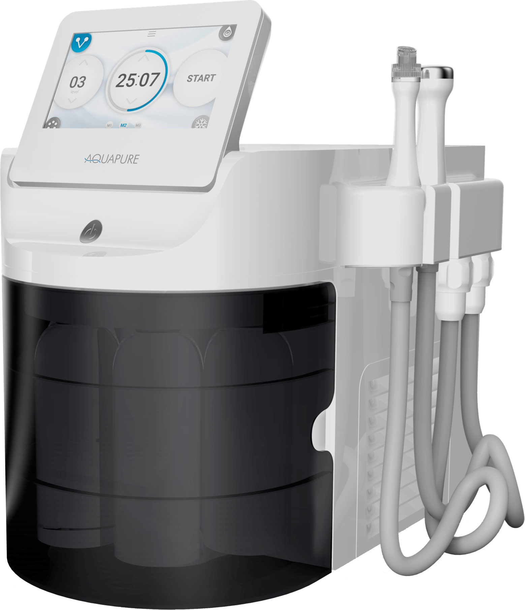
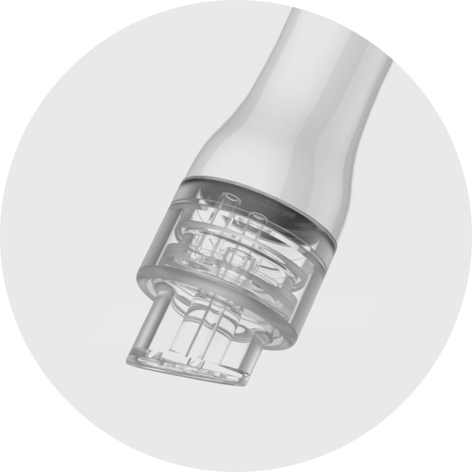
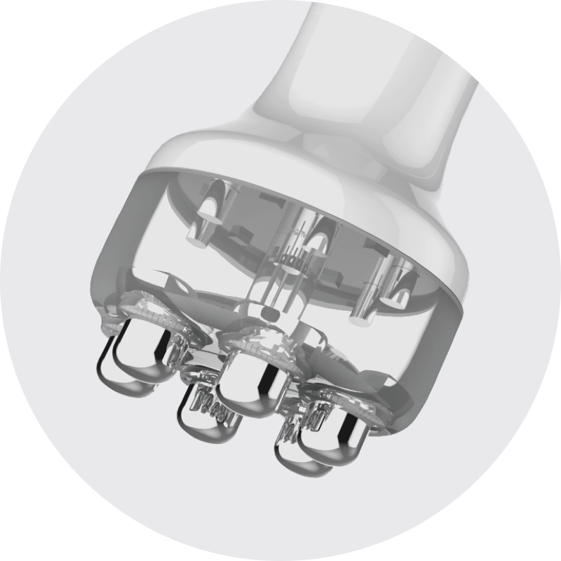
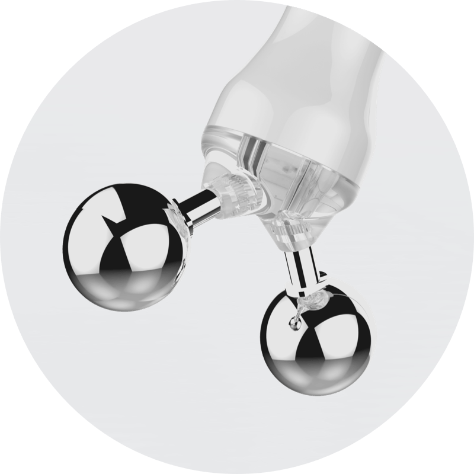
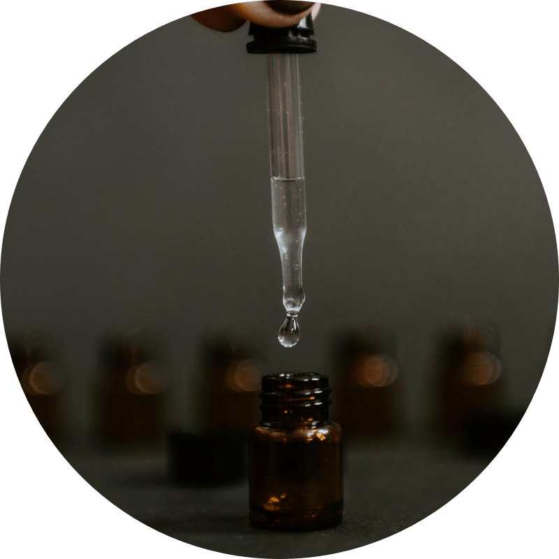
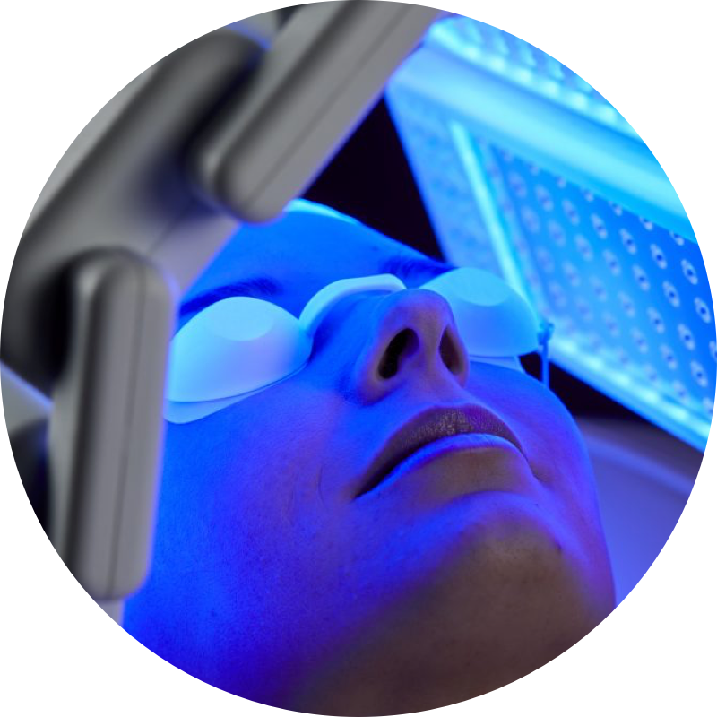

  

    

      <svg class="hidden xl:block absolute right-0 inset-y-0 h-full w-48 text-white transform translate-x-1/2" fill="currentColor" viewBox="0 0 100 100" preserveAspectRatio="none" aria-hidden="true">
        <polygon points="50,0 100,0 50,100 0,100" />
      </svg>

      

        <nav class="relative flex items-baseline" aria-label="Global">
          

            
          

          
Medicina Estética

        </nav>
      

      <main class="mt-10 mx-auto max-w-2xl px-4 sm:mt-12 sm:px-6 md:mt-16 lg:mt-20 lg:px-8 xl:mt-28">
        

          <h1 class="text-3xl tracking-tight font-extrabold text-gray-900 sm:text-5xl">
            Limpieza facial
              profunda
            para quitar los puntos negros
          </h1>
          

            Doble limpieza de la cara para eliminar puntos negros de la
            nariz, mejorar el acné, y rosácea. Tecnología coreana sumada al
            expertise dermatológico, para crear un plan de tratamiento
            específico para tu piel.
          

          

            

              <a href="#video" class="w-full flex items-center justify-center
                px-8 py-3 border border-transparent font-medium rounded-md
                text-white bg-rose md:py-4 md:text-lg md:px-10">
                Saber más
              </a>
            

            

              <a href="#pricing" class="w-full flex items-center
                justify-center px-8 py-3 border border-transparent
                font-medium rounded-md text-rose md:py-4 md:text-lg md:px-10">
                Ver precios
              </a>
            

          

        

      </main>
    

  

  

    
  

  

    

      <h2 class="font-semibold text-rose uppercase
        tracking-wide">TU PIEL LIMPIA E HIDRATADA</h2>
      <h2 class="text-3xl font-extrabold text-coal">
        Limpieza profunda + activos
      </h2>
    

    <dl class="space-y-10 lg:space-y-0 lg:grid lg:grid-cols-3 lg:gap-16">
      

        

          
        

        

          <dt class="text-2xl mb-4 leading-6 font-medium text-rose">
            Hidrodermabrasión
          </dt>
          <dd class="prose md:prose-lg mt-2 text-iron">
            Exfoliación con la piel húmeda con boquilla en forma de espiral.
            Con una succión muy suave, elimina impurezas, puntos negros y
            células muertas e en el siguiente paso introduce soluciones
            dermatológicas para tratar e hidratar la piel.
          </dd>
        

      

      

        

          
        

        

          <dt class="text-2xl mb-4 leading-6 font-medium text-rose">
            Electroporación
          </dt>
          <dd class="prose md:prose-lg mt-2 text-iron">
            Mediante conducción eléctrica, se abren los poros, aumentando la
            permeabilidad de la piel, facilitando la absorción de nutrientes
            en las capas más profundas.
          </dd>
        

      

      

        

          
        

        

          <dt class="text-2xl mb-4 leading-6 font-medium text-rose">
            Microcorrientes
          </dt>
          <dd class="prose md:prose-lg mt-2 text-iron">
            Tensa la piel, favorece la regeneración del colágeno y
            proporciona un efecto lifting a través de impulsos eléctricos a
            los músculos faciales.
          </dd>
        

      

    </dl>
  

  <video
    class="w-full md:w-4/5 h-auto appearance-none mx-auto relative"
    poster="aquapure-video-poster.png"
    controls
    preload="auto"
  >
    <source src="https://dermabile.s3.amazonaws.com/assets/aquapure.webm" type="video/webm" />
    <source src="https://dermabile.s3.amazonaws.com/assets/aquapure.mp4" type="video/mp4" />
  </video>

  

    

      <h2 class="font-semibold text-rose uppercase
        tracking-wide">El efecto wow</h2>
      <h2 class="text-3xl font-extrabold text-white">
        Protocolo Piel Radiante
      </h2>
    

    <dl class="space-y-10 lg:space-y-0 lg:grid lg:grid-cols-2 lg:gap-24">
      

        

          
        

        

          <dt class="text-2xl mb-4 leading-6 font-medium text-peach">
            Peeling enzimático
          </dt>
          <dd class="mt-2 prose md:prose-lg text-cool-gray">
            Evaluación dermatológica personalizada para tu tipo piel, y
            aplicación de peelings químicos específicos para los resultados
            que buscas, para promover el rejuvenecimiento facial o actuar en
            acné, rosácea y manchas.
          </dd>
        

      

      

        

          
        

        

          <dt class="text-2xl mb-4 leading-6 font-medium text-peach">
            Fototerapia
          </dt>
          <dd class="mt-2 prose md:prose-lg text-cool-gray">
            Aplicación de laser de diodo de baja intensidad que activan
            fotoreceptores en la piel, produciendo respuestas biológicas
            celulares para una reparación y renovación celular.  Nuestro
            protocolo combina distintos  colores de luz personalizados a tu
            piel, para acalmar y renovar la piel y con efecto antibacteriano
            en caso de acné.
          </dd>
        

      

    </dl>
  

  

  

    

      <h2 class="font-semibold text-rose uppercase
        tracking-wide">Nuestro diferencial</h2>
      <h2 class="text-3xl font-extrabold text-iron">
        ¿Porqué escoger Dermábile?
      </h2>
    

    <dl class="lg:grid lg:grid-cols-2 lg:gap-24">
      

        
        

          

            En Dermábile todos los protocolos médicos son diseñados y
            realizados por la Dra. Vanessa Martins, además del seguimiento
            del tratamiento, garantizando atención y soporte a los pacientes
            antes, durante, y después de los procedimientos.
          

          

            La Dra. Vanessa Martins es dermatóloga brasileña, con Máster y
            Doctorado en Dermatología por la Universidad de Barcelona, y
            Máster en Medicina Estética por la Universidad de las Islas
            Baleares. Sus años de experiencia clínica, sumados al rigor
            científico y académico, le permite diseñar protocolos de
            tratamientos personalizados para cada paciente con mayor
            seguridad y eficacia, alcanzando resultados óptimos con el mejor
            costo-beneficio para el paciente.
          

        

      

      

        

          <svg class="absolute top-0 left-0 transform -translate-x-8
            -translate-y-24 h-36 w-36 text-rose opacity-50" stroke="currentColor" fill="none" viewBox="0 0 144 144" aria-hidden="true">
            <path stroke-width="2" d="M41.485 15C17.753 31.753 1 59.208 1 89.455c0 24.664 14.891 39.09 32.109 39.09 16.287 0 28.386-13.03 28.386-28.387 0-15.356-10.703-26.524-24.663-26.524-2.792 0-6.515.465-7.446.93 2.327-15.821 17.218-34.435 32.11-43.742L41.485 15zm80.04 0c-23.268 16.753-40.02 44.208-40.02 74.455 0 24.664 14.891 39.09 32.109 39.09 15.822 0 28.386-13.03 28.386-28.387 0-15.356-11.168-26.524-25.129-26.524-2.792 0-6.049.465-6.98.93 2.327-15.821 16.753-34.435 31.644-43.742L121.525 15z" />
          </svg>
          <blockquote class="relative">
            

              

                La Doctora Vanessa es una excelente profesional, muy atenta,
                delicada y con mucho conocimiento a nivel médico,
                dermatológico y estético. Confío plenamente en ella y nadie
                más le pondría mi rostro! Muy recomendada.
              

            

            <footer class="mt-4">
              

                

                  
&mdash; Manuela N

                

              

            </footer>
          </blockquote>
        

      

    </dl>
  

  

    

      

        

          

            

              

                

                  <h3 class="text-center text-2xl font-medium text-gray-900" id="tier-hobby">
                    Express 30&rsquo;
                  </h3>
                  

                    
                      
                        100
                      
                      
                       €
                      
                    
                  

                

              

              

                <ul class="space-y-4">
                  <li class="flex items-start">
                    

                      <svg class="flex-shrink-0 h-6 w-6 text-peach" xmlns="http://www.w3.org/2000/svg" fill="none" viewBox="0 0 24 24" stroke="currentColor" aria-hidden="true">
                        <path stroke-linecap="round" stroke-linejoin="round" stroke-width="2" d="M5 13l4 4L19 7" />
                      </svg>
                    

                    

                      Hidrodermabrasión
                    

                  </li>

                  <li class="flex items-start">
                    

                      <svg class="flex-shrink-0 h-6 w-6 text-peach" xmlns="http://www.w3.org/2000/svg" fill="none" viewBox="0 0 24 24" stroke="currentColor" aria-hidden="true">
                        <path stroke-linecap="round" stroke-linejoin="round" stroke-width="2" d="M5 13l4 4L19 7" />
                      </svg>
                    

                    

                      Electroporación
                    

                  </li>
                  <li class="flex items-start">
                    

                      <svg class="flex-shrink-0 h-6 w-6 text-peach" xmlns="http://www.w3.org/2000/svg" fill="none" viewBox="0 0 24 24" stroke="currentColor" aria-hidden="true">
                        <path stroke-linecap="round" stroke-linejoin="round" stroke-width="2" d="M5 13l4 4L19 7" />
                      </svg>
                    

                    

                      Avaliación dermatológica
                    

                  </li>
                </ul>
              

            

          

        

        

          

            

            

              

                
                  ★★★★★
                
              

            

            

              

                <h3 class="text-center text-3xl font-semibold text-gray-900 sm:-mx-6" id="tier-growth">
                  Piel Radiante
                </h3>
                

                  
                    
                      130
                    
                    
                     €
                    
                  
                

                

                  * por sesión en pack de 3 sesiones (total 390€). Sesión
                  única sin pack por 160€.
                

              

            

            

              <ul class="space-y-4">
                <li class="flex items-start">
                  

                    <svg class="flex-shrink-0 h-6 w-6 text-peach" xmlns="http://www.w3.org/2000/svg" fill="none" viewBox="0 0 24 24" stroke="currentColor" aria-hidden="true">
                      <path stroke-linecap="round" stroke-linejoin="round" stroke-width="2" d="M5 13l4 4L19 7" />
                    </svg>
                  

                  

                    Hidrodermabrasión
                  

                </li>

                <li class="flex items-start">
                  

                    <svg class="flex-shrink-0 h-6 w-6 text-peach" xmlns="http://www.w3.org/2000/svg" fill="none" viewBox="0 0 24 24" stroke="currentColor" aria-hidden="true">
                      <path stroke-linecap="round" stroke-linejoin="round" stroke-width="2" d="M5 13l4 4L19 7" />
                    </svg>
                  

                  

                    Electroporación
                  

                </li>

                <li class="flex items-start">
                  

                    <svg class="flex-shrink-0 h-6 w-6 text-peach" xmlns="http://www.w3.org/2000/svg" fill="none" viewBox="0 0 24 24" stroke="currentColor" aria-hidden="true">
                      <path stroke-linecap="round" stroke-linejoin="round" stroke-width="2" d="M5 13l4 4L19 7" />
                    </svg>
                  

                  

                    Microcorrientes
                  

                </li>

                <li class="flex items-start">
                  

                    <svg class="flex-shrink-0 h-6 w-6 text-peach" xmlns="http://www.w3.org/2000/svg" fill="none" viewBox="0 0 24 24" stroke="currentColor" aria-hidden="true">
                      <path stroke-linecap="round" stroke-linejoin="round" stroke-width="2" d="M5 13l4 4L19 7" />
                    </svg>
                  

                  

                    Avaliación dermatológica
                  

                </li>

                <li class="flex items-start">
                  

                    <svg class="flex-shrink-0 h-6 w-6 text-peach" xmlns="http://www.w3.org/2000/svg" fill="none" viewBox="0 0 24 24" stroke="currentColor" aria-hidden="true">
                      <path stroke-linecap="round" stroke-linejoin="round" stroke-width="2" d="M5 13l4 4L19 7" />
                    </svg>
                  

                  

                    Peeling enzimático
                  

                </li>

                <li class="flex items-start">
                  

                    <svg class="flex-shrink-0 h-6 w-6 text-peach" xmlns="http://www.w3.org/2000/svg" fill="none" viewBox="0 0 24 24" stroke="currentColor" aria-hidden="true">
                      <path stroke-linecap="round" stroke-linejoin="round" stroke-width="2" d="M5 13l4 4L19 7" />
                    </svg>
                  

                  

                    Fototerapia
                  

                </li>
              </ul>
            

          

        

      

    

  

  

    

      Para saber más, contacta con nosotros:
    

    

      <a href="https://wa.me/34931770530" class="px-6 py-3 border
               border-transparent text-lg font-medium text-center
        rounded-md shadow-sm text-white bg-green-500 
        focus:outline-none my-2 md:my-0"
        onclick="checkout({ contents: [{ id: 'aquapure', quantity: 1 }] })"
      >
        <i class="fab fa-whatsapp mr-2"></i> 931 770 530
      </a>
      <a href="tel:931770530" class="px-6 py-3 text-center
        border border-transparent text-lg font-medium rounded-md shadow-sm text-black bg-gray-300 focus:outline-none my-2 md:my-0"
        onclick="checkout({ contents: [{ id: 'aquapure', quantity: 1 }] })"
      >
        <i class="fal fa-phone-office mr-2"></i> 931 770 530
      </a>
      <button class="px-6 py-3
        border border-transparent text-lg font-medium rounded-md shadow-sm
        text-white bg-rose focus:outline-none my-2 md:my-0"
        onclick="checkout({ contents: [{ id: 'aquapure', quantity: 1 }] }, true)"
      >
        <i class="fas fa-comments mr-2"></i> Chat
      </button>
    

  

