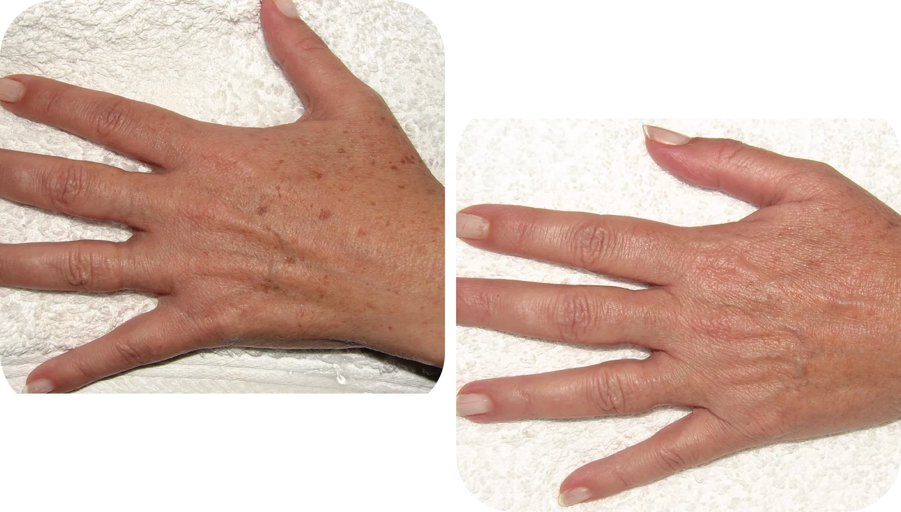
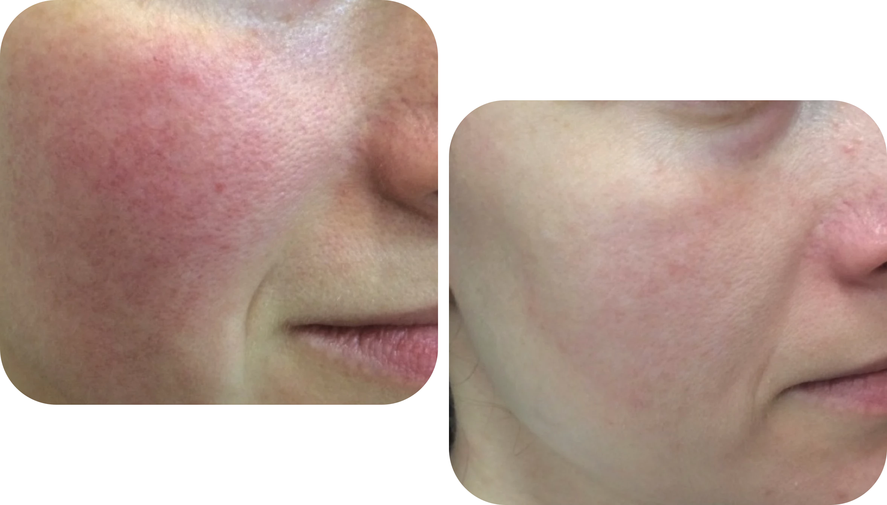
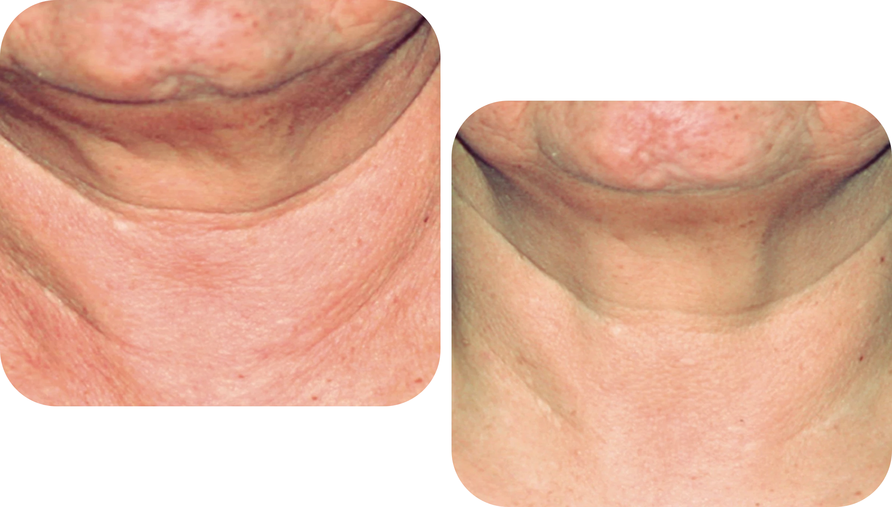

  

    

      <svg class="hidden xl:block absolute right-0 inset-y-0 h-full w-48 text-white transform translate-x-1/2" fill="currentColor" viewBox="0 0 100 100" preserveAspectRatio="none" aria-hidden="true">
        <polygon points="50,0 100,0 50,100 0,100" />
      </svg>

      

        <nav class="relative flex items-baseline" aria-label="Global">
          

            
          

          
Medicina Estética

        </nav>
      

      <main class="mt-10 mx-auto max-w-2xl px-4 sm:mt-12 sm:px-6 md:mt-16 lg:mt-20 lg:px-8 xl:mt-28">
        

          <h1 class="text-3xl tracking-tight font-extrabold text-gray-900 sm:text-5xl">
            Luce una piel 
            uniforme,
            sana
            y de apariencia 
            más joven.
          </h1>
          

            Elimina las huellas de los años y manchas del sol, y consigue un
            rejuvenecimiento global del rostro, cuello, escote y manos con la
            plataforma más moderna del mercado &mdash; Stellar M22 de Lumenis
          

          

              <a href="#faq" class="px-6 py-3 text-lg font-medium rounded-md shadow-sm text-white bg-rose">
                Saber más
              </a>
            <button class="px-6 py-3 text-lg font-medium rounded-md shadow-sm text-white bg-green-500"
              onclick="checkout({ contents: [{ id: 'm22', quantity: 1 }] }, true)"
            >
              Pedir cita
            </button>
          

        

      </main>
    

  

  

    
  

  

    

      <h2 class="font-semibold text-rose uppercase
        tracking-wide">TECNOLOGÍA VERSÁTIL</h2>
      <h2 class="text-3xl font-extrabold text-coal mt-4">
        Actúa en diferentes dianas en la misma sesión
      </h2>
    

    

      

        <article class="group mb-8">
          

          

            <i class="fal fa-chevron-right absolute right-0 top-1/2 text-gray-400 mr-4 hidden lg:inline"></i>
            <a href="#img-1" x-on:click="img = 1">
              

              <h3 class="text-2xl mb-2 leading-6 font-medium text-rose"
              x-bind:class="{ 'lg:font-extrabold': img == 1 }">
                Manchas
              </h3>
            </a>

            

              Combate las manchas de acné, y sobretodo del sol, aclarando y
              uniformizando el tono de la piel.
            

          

        </article>

        <article class="group mb-8">
          

          

            <i class="fal fa-chevron-right absolute right-0 top-1/2 text-gray-400 mr-4 hidden lg:inline"></i>
            <a href="#img-2" x-on:click="img = 2">
              

              <h3 class="text-2xl mb-2 leading-6 font-medium text-rose"
              x-bind:class="{ 'lg:font-extrabold': img == 2 }">
                Rosacea
              </h3>
            </a>

            

              Suaviza rojeces, principalmente la rosacea, venitas faciales y
              también marcas de acné.
            

          

        </article>

        <article class="group">
          

          

            <i class="fal fa-chevron-right absolute right-0 top-1/2 text-gray-400 mr-4 hidden lg:inline"></i>
            <a href="#img-3" x-on:click="img = 3">
              

              <h3 class="text-2xl mb-2 leading-6 font-medium text-rose"
              x-bind:class="{ 'lg:font-extrabold': img == 3 }">
                Textura
              </h3>
            </a>

            

              Estimula la producción de colágeno con mejoría global de la calidad
              de la piel y poros, aparentando una piel más joven.
            

          

        </article>
      

      

        
        
        
      

    

  

  

    

      <h2 class="font-semibold text-rose uppercase
        tracking-wide">Nuestro diferencial</h2>
    

    <dl class="lg:grid lg:grid-cols-2 lg:px-8">
      
      

        

          En Dermábile todos los protocolos médicos son diseñados y realizados
          por la Dra. Vanessa Martins, además del seguimiento del tratamiento,
          garantizando atención y soporte a los pacientes antes, durante, y
          después de los procedimientos.
        

        

          Juntamente con el M22, nuestros protocolos multi-tratamientos
          de asociación con peelings proporcionan resultados superiores,
          con más seguridad y aspectos naturales.
        

      

    </dl>
  

  

    

      <h2 class="font-semibold text-rose uppercase
        tracking-wide" id="faq">PREGUNTAS FRECUENTES</h2>
    

    <dl class="max-w-3xl mx-auto px-4 space-y-6 divide-y divide-gray-200">
      

        <dt class="prose md:prose-xl">
          <button type="button" class="text-left w-full flex justify-between items-start text-gray-400 focus:outline-none" x-on:click="open = !open">
            
              ¿Qué es la luz intensa pulsada?
            
            
              <svg x-bind:class="open ? '-rotate-180' : 'rotate-0'" class="rotate-0 h-6 w-6 transform" xmlns="http://www.w3.org/2000/svg" fill="none" viewBox="0 0 24 24" stroke="currentColor" aria-hidden="true">
                <path stroke-linecap="round" stroke-linejoin="round" stroke-width="2" d="M19 9l-7 7-7-7" />
              </svg>
            
          </button>
        </dt>
        <dd class="mt-2" x-bind:class="{ hidden: !open }">
          

            La luz pulsada es un tratamiento que permite mejorar gradualmente la
            textura y tonalidad, poros dilatados, rojeces, manchas, lesiones
            pigmentadas, capilares rotos y arrugas finas. Desde la primera
            sesión de IPL es posible obtener una mejoría del tono y una piel más
            luminosa.
          

        </dd>
      

      

        <dt class="prose md:prose-xl">
          <button type="button" class="text-left w-full flex justify-between items-start text-gray-400 focus:outline-none" x-on:click="open = !open">
            
              ¿En qué zonas del cuerpo se puede tratar con IPL?
            
            
              <svg x-bind:class="open ? '-rotate-180' : 'rotate-0'" class="rotate-0 h-6 w-6 transform" xmlns="http://www.w3.org/2000/svg" fill="none" viewBox="0 0 24 24" stroke="currentColor" aria-hidden="true">
                <path stroke-linecap="round" stroke-linejoin="round" stroke-width="2" d="M19 9l-7 7-7-7" />
              </svg>
            
          </button>
        </dt>
        <dd class="mt-2" x-bind:class="{ hidden: !open }">
          

            Se puede aplicar  en la piel facial, cuello, escote y manos y en
            múltiples zonas a la vez.
          

        </dd>
      

      

        <dt class="prose md:prose-xl">
          <button type="button" class="text-left w-full flex justify-between items-start text-gray-400 focus:outline-none" x-on:click="open = !open">
            
              ¿Necesito alguna preparación de la piel para realizar luz pulsada?
            
            
              <svg x-bind:class="open ? '-rotate-180' : 'rotate-0'" class="rotate-0 h-6 w-6 transform" xmlns="http://www.w3.org/2000/svg" fill="none" viewBox="0 0 24 24" stroke="currentColor" aria-hidden="true">
                <path stroke-linecap="round" stroke-linejoin="round" stroke-width="2" d="M19 9l-7 7-7-7" />
              </svg>
            
          </button>
        </dt>
        <dd class="mt-2" x-bind:class="{ hidden: !open }">
          

            El paciente no debe estar bronceado, ni tomado sol en las 3 semanas
            anteriores al tratamiento o hecho procedimientos recientemente en la
            zona como puede ser peelings, depilación o laser.
          

        </dd>
      

      

        <dt class="prose md:prose-xl">
          <button type="button" class="text-left w-full flex justify-between items-start text-gray-400 focus:outline-none" x-on:click="open = !open">
            
              ¿Cuántas sesiones son necesarias? Cuánto tardan las sesiones?
            
            
              <svg x-bind:class="open ? '-rotate-180' : 'rotate-0'" class="rotate-0 h-6 w-6 transform" xmlns="http://www.w3.org/2000/svg" fill="none" viewBox="0 0 24 24" stroke="currentColor" aria-hidden="true">
                <path stroke-linecap="round" stroke-linejoin="round" stroke-width="2" d="M19 9l-7 7-7-7" />
              </svg>
            
          </button>
        </dt>
        <dd class="mt-2" x-bind:class="{ hidden: !open }">
          

            El número de sesiones depende de cada persona, del problema y de la
            zona a tratar. Suelen necesitarse unas 2-4 sesiones cada 30-45 días,
            aunque según el tipo de piel o las necesidades del paciente podrían
            incrementarse el número de estas. Sesiones de mantenimiento 1-2
            veces al año normalmente están indicadas. Los tratamientos faciales
            suelen tardar 20-30 minutos. 
          

        </dd>
      

      

        <dt class="prose md:prose-xl">
          <button type="button" class="text-left w-full flex justify-between items-start text-gray-400 focus:outline-none" x-on:click="open = !open">
            
              ¿Cuáles son los cuidados post tratamiento?
            
            
              <svg x-bind:class="open ? '-rotate-180' : 'rotate-0'" class="rotate-0 h-6 w-6 transform" xmlns="http://www.w3.org/2000/svg" fill="none" viewBox="0 0 24 24" stroke="currentColor" aria-hidden="true">
                <path stroke-linecap="round" stroke-linejoin="round" stroke-width="2" d="M19 9l-7 7-7-7" />
              </svg>
            
          </button>
        </dt>
        <dd class="mt-2" x-bind:class="{ hidden: !open }">
          

            Se debe limpiar la piel con cuidado con jabón suave, no
            frotar,  usar hidratante y protección solar, además de evitar
            fuentes de calor y cualquier otro procedimiento en la zona hasta
            que la piel se recupere del todo.
          

        </dd>
      

      

        <dt class="prose md:prose-xl">
          <button type="button" class="text-left w-full flex justify-between items-start text-gray-400 focus:outline-none" x-on:click="open = !open">
            
              ¿Cuáles son los precios del tratamiento?
            
            
              <svg x-bind:class="open ? '-rotate-180' : 'rotate-0'" class="rotate-0 h-6 w-6 transform" xmlns="http://www.w3.org/2000/svg" fill="none" viewBox="0 0 24 24" stroke="currentColor" aria-hidden="true">
                <path stroke-linecap="round" stroke-linejoin="round" stroke-width="2" d="M19 9l-7 7-7-7" />
              </svg>
            
          </button>
        </dt>
        <dd class="mt-2" x-bind:class="{ hidden: !open }">
          

            Los precios del tratamiento varían según el área específica del
            cuerpo que se trate y la cantidad de sesiones necesarias. Las
            sesiones pueden oscilar desde unos cientos de euros hasta valores
            más elevados, dependiendo de los factores mencionados.
          

        </dd>
      

      

        <dt class="prose md:prose-xl">
          <button type="button" class="text-left w-full flex justify-between items-start text-gray-400 focus:outline-none" x-on:click="open = !open">
            
              ¿Cuál es la diferencia entre IPL y láser?
            
            
              <svg x-bind:class="open ? '-rotate-180' : 'rotate-0'" class="rotate-0 h-6 w-6 transform" xmlns="http://www.w3.org/2000/svg" fill="none" viewBox="0 0 24 24" stroke="currentColor" aria-hidden="true">
                <path stroke-linecap="round" stroke-linejoin="round" stroke-width="2" d="M19 9l-7 7-7-7" />
              </svg>
            
          </button>
        </dt>
        <dd class="mt-2" x-bind:class="{ hidden: !open }">
          

            Ambas tecnologías se utilizan para tratamientos similares, pero la
            elección entre luz pulsada y láser dependerá de la condición
            específica a tratar.

            La IPL es el tratamiento gold standard para
            fotoenvejecimiento ya que la piel presenta manchas, capilares rotos
            y pérdida de colágeno, pero no produce microcanales como puede
            hacerlo un láser. Para cambios de textura o remoción de verrugas un
            láser estaría más bien indicado.
          

        </dd>
      

      

        <dt class="prose md:prose-xl">
          <button type="button" class="text-left w-full flex justify-between items-start text-gray-400 focus:outline-none" x-on:click="open = !open">
            
              ¿IPL para melasma?
            
            
              <svg x-bind:class="open ? '-rotate-180' : 'rotate-0'" class="rotate-0 h-6 w-6 transform" xmlns="http://www.w3.org/2000/svg" fill="none" viewBox="0 0 24 24" stroke="currentColor" aria-hidden="true">
                <path stroke-linecap="round" stroke-linejoin="round" stroke-width="2" d="M19 9l-7 7-7-7" />
              </svg>
            
          </button>
        </dt>
        <dd class="mt-2" x-bind:class="{ hidden: !open }">
          

            Aunque la IPL pueda ser una opción en algunos casos de melasma,
            generalmente no se considera un tratamiento de primera línea.
            Existen varias razones para la preferencia por otras opciones como
            respuesta variable, riesgo de empeoramiento, necesidad de múltiples
            sesiones, etc. Es fundamental que las personas con melasma busquen
            la orientación de un dermatólogo para determinar el enfoque de
            tratamiento más adecuado según su situación específica.
          

        </dd>
      

    </dl>
  

  

    Para saber más, contacta con nosotros
  

  

    <a href="https://wa.me/34931770530" class="px-6 py-3 border
             border-transparent text-lg font-medium text-center
      rounded-md shadow-sm text-white bg-green-500 
      focus:outline-none my-2 md:my-0"
      onclick="checkout({ contents: [{ id: 'm22', quantity: 1 }] })"
    >
      <i class="fab fa-whatsapp mr-2"></i> 931 770 530
    </a>
    <a href="tel:931770530" class="px-6 py-3 text-center
      border border-transparent text-lg font-medium rounded-md shadow-sm text-black bg-gray-300 focus:outline-none my-2 md:my-0"
      onclick="checkout({ contents: [{ id: 'm22', quantity: 1 }] })"
    >
      <i class="fal fa-phone-office mr-2"></i> 931 770 530
    </a>
    <button class="px-6 py-3
      border border-transparent text-lg font-medium rounded-md shadow-sm
      text-white bg-rose focus:outline-none my-2 md:my-0"
      onclick="checkout({ contents: [{ id: 'm22', quantity: 1 }] }, true)"
    >
      <i class="fas fa-comments mr-2"></i> Chat
    </button>
  

