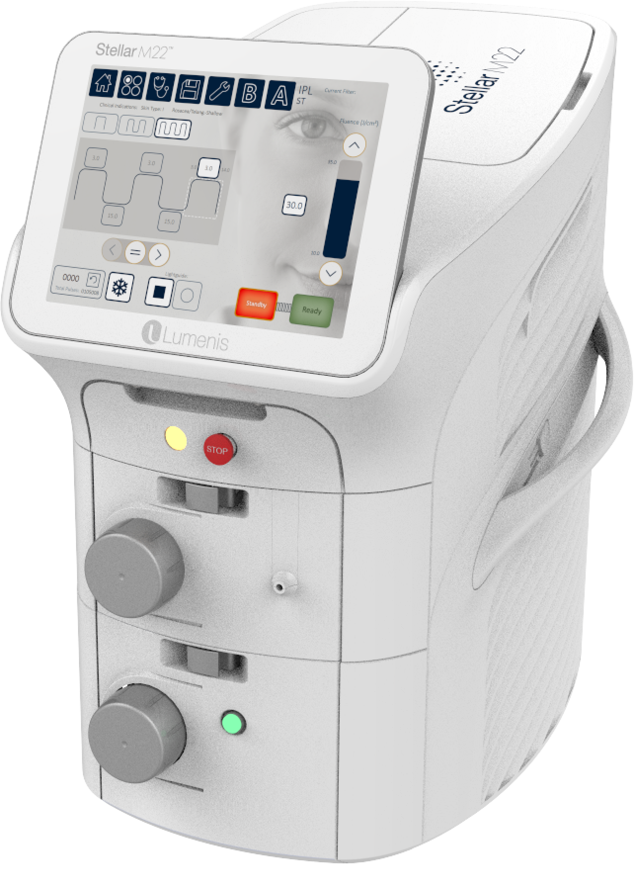

  

    

      <svg class="hidden xl:block absolute right-0 inset-y-0 h-full w-48 text-white transform translate-x-1/2" fill="currentColor" viewBox="0 0 100 100" preserveAspectRatio="none" aria-hidden="true">
        <polygon points="50,0 100,0 50,100 0,100" />
      </svg>

      

        <nav class="relative flex items-baseline" aria-label="Global">
          

            
          

          
Medicina Estética

        </nav>
      

      <main class="mt-10 mx-auto max-w-2xl px-4 sm:mt-12 sm:px-6 md:mt-16 lg:mt-20 lg:px-8 xl:mt-28">
        

          <h1 class="text-3xl tracking-tight font-extrabold text-gray-900 sm:text-5xl">
            Tratamiento de 
            manchas y rojeces
            con luz intensa pulsada 
          </h1>
          

            Luce una piel uniforme, sana y de apariencia más joven con la
            plataforma más moderna del mercado &mdash; Stellar M22 de Lumenis
          

          

            

              <a href="#faq" class="w-full flex items-center justify-center
                px-8 py-3 border border-transparent font-medium rounded-md
                text-white bg-rose md:py-4 md:text-lg md:px-10">
                Saber más
              </a>
            

          

        

      </main>
    

  

  

    
  

  

    

      <h2 class="font-semibold text-rose uppercase
        tracking-wide">TECNOLOGÍA VERSÁTIL</h2>
      <h2 class="text-3xl font-extrabold text-coal">
        Actúa en diferentes dianas en la misma sesión
      </h2>
    

    <dl class="space-y-10 lg:space-y-0 lg:grid lg:grid-cols-3 lg:gap-16">
      

        

          <dt class="text-2xl mb-4 leading-6 font-medium text-rose">
            Manchas
          </dt>
          <dd class="prose md:prose-lg mt-2 text-iron">
            La energía es dirigida contra la melanina de las
            hiperpigmentaciones, aclarando y uniformizando el tono de la
            piel.
          </dd>
        

      

      

        

          <dt class="text-2xl mb-4 leading-6 font-medium text-rose">
            Rojeces
          </dt>
          <dd class="prose md:prose-lg mt-2 text-iron">
            La plataforma tiene filtros específicos para el color rojo, tratando
            las venitas faciales y también rosacea y marcas de acné.
          </dd>
        

      

      

        

          <dt class="text-2xl mb-4 leading-6 font-medium text-rose">
            Textura
          </dt>
          <dd class="prose md:prose-lg mt-2 text-iron">
            Mediante generación de calor es capaz de estimular producción de
            colágeno con mejoría global de la calidad de la piel y poros.
          </dd>
        

      

    </dl>
  

  

    

      <h2 class="font-semibold text-rose uppercase
        tracking-wide">Nuestro diferencial</h2>
    

    <dl class="md:grid md:grid-cols-2 md:px-8">
      
      

        

          En Dermábile todos los protocolos médicos son diseñados y realizados
          por la Dra. Vanessa Martins, además del seguimiento del tratamiento,
          garantizando atención y soporte a los pacientes antes, durante, y
          después de los procedimientos.
        

        

          Juntamente con el M22, nuestros protocolos multi-tratamientos
          de asociación con peelings proporcionan resultados superiores,
          con más seguridad y aspectos naturales
        

      

    </dl>
  

  

    

      <h2 class="font-semibold text-rose uppercase
        tracking-wide" id="faq">PREGUNTAS FRECUENTES</h2>
    

    <dl class="max-w-3xl mx-auto px-4 space-y-6 divide-y divide-gray-200">
      

        <dt class="prose md:prose-xl">
          <button type="button" class="text-left w-full flex justify-between items-start text-gray-400 focus:outline-none" x-on:click="open = !open">
            
              Qué es la luz intensa pulsada?
            
            
              <svg x-bind:class="open ? '-rotate-180' : 'rotate-0'" class="rotate-0 h-6 w-6 transform" xmlns="http://www.w3.org/2000/svg" fill="none" viewBox="0 0 24 24" stroke="currentColor" aria-hidden="true">
                <path stroke-linecap="round" stroke-linejoin="round" stroke-width="2" d="M19 9l-7 7-7-7" />
              </svg>
            
          </button>
        </dt>
        <dd class="mt-2" x-bind:class="{ hidden: !open }">
          

            La luz pulsada es un tratamiento que permite mejorar gradualmente la
            textura y tonalidad, poros dilatados, rojeces, manchas, lesiones
            pigmentadas, capilares rotos y arrugas finas. Desde la primera
            sesión de IPL es posible obtener una mejoría del tono y una piel más
            luminosa.
          

        </dd>
      

      

        <dt class="prose md:prose-xl">
          <button type="button" class="text-left w-full flex justify-between items-start text-gray-400 focus:outline-none" x-on:click="open = !open">
            
              En qué zonas del cuerpo se puede tratar con IPL?
            
            
              <svg x-bind:class="open ? '-rotate-180' : 'rotate-0'" class="rotate-0 h-6 w-6 transform" xmlns="http://www.w3.org/2000/svg" fill="none" viewBox="0 0 24 24" stroke="currentColor" aria-hidden="true">
                <path stroke-linecap="round" stroke-linejoin="round" stroke-width="2" d="M19 9l-7 7-7-7" />
              </svg>
            
          </button>
        </dt>
        <dd class="mt-2" x-bind:class="{ hidden: !open }">
          

            Se puede aplicar  en la piel facial, cuello, escote y manos y en
            múltiples zonas a la vez.
          

        </dd>
      

      

        <dt class="prose md:prose-xl">
          <button type="button" class="text-left w-full flex justify-between items-start text-gray-400 focus:outline-none" x-on:click="open = !open">
            
              Necesito alguna preparación de la piel para realizar luz pulsada?
            
            
              <svg x-bind:class="open ? '-rotate-180' : 'rotate-0'" class="rotate-0 h-6 w-6 transform" xmlns="http://www.w3.org/2000/svg" fill="none" viewBox="0 0 24 24" stroke="currentColor" aria-hidden="true">
                <path stroke-linecap="round" stroke-linejoin="round" stroke-width="2" d="M19 9l-7 7-7-7" />
              </svg>
            
          </button>
        </dt>
        <dd class="mt-2" x-bind:class="{ hidden: !open }">
          

            El paciente no debe estar bronceado, ni tomado sol en las 3 semanas
            anteriores al tratamiento o hecho procedimientos recientemente en la
            zona como puede ser peelings, depilación o laser.
          

        </dd>
      

      

        <dt class="prose md:prose-xl">
          <button type="button" class="text-left w-full flex justify-between items-start text-gray-400 focus:outline-none" x-on:click="open = !open">
            
              Cuántas sesiones son necesarias? Cuánto tardan las sesiones?
            
            
              <svg x-bind:class="open ? '-rotate-180' : 'rotate-0'" class="rotate-0 h-6 w-6 transform" xmlns="http://www.w3.org/2000/svg" fill="none" viewBox="0 0 24 24" stroke="currentColor" aria-hidden="true">
                <path stroke-linecap="round" stroke-linejoin="round" stroke-width="2" d="M19 9l-7 7-7-7" />
              </svg>
            
          </button>
        </dt>
        <dd class="mt-2" x-bind:class="{ hidden: !open }">
          

            El número de sesiones depende de cada persona, del problema y de la
            zona a tratar. Suelen necesitarse unas 2-4 sesiones cada 30-45 días,
            aunque según el tipo de piel o las necesidades del paciente podrían
            incrementarse el número de estas. Sesiones de mantenimiento 1-2
            veces al año normalmente están indicadas. Los tratamientos faciales
            suelen tardar 20-30 minutos. 
          

        </dd>
      

      

        <dt class="prose md:prose-xl">
          <button type="button" class="text-left w-full flex justify-between items-start text-gray-400 focus:outline-none" x-on:click="open = !open">
            
              Cuáles son los cuidados post tratamiento?
            
            
              <svg x-bind:class="open ? '-rotate-180' : 'rotate-0'" class="rotate-0 h-6 w-6 transform" xmlns="http://www.w3.org/2000/svg" fill="none" viewBox="0 0 24 24" stroke="currentColor" aria-hidden="true">
                <path stroke-linecap="round" stroke-linejoin="round" stroke-width="2" d="M19 9l-7 7-7-7" />
              </svg>
            
          </button>
        </dt>
        <dd class="mt-2" x-bind:class="{ hidden: !open }">
          

            Se debe limpiar la piel con cuidado con jabón suave, no
            frotar,  usar hidratante y protección solar, además de evitar
            fuentes de calor y cualquier otro procedimiento en la zona hasta
            que la piel se recupere del todo.
          

        </dd>
      

    </dl>
  

  

    Para saber más, contacta con nosotros
  

  

    <a href="https://wa.me/34931071834" class="px-6 py-3 border
             border-transparent text-lg font-medium text-center
      rounded-md shadow-sm text-white bg-green-500 
      focus:outline-none my-2 md:my-0"
      onclick="checkout({ contents: [{ id: 'm22', quantity: 1 }] })"
    >
      <i class="fab fa-whatsapp mr-2"></i> 931 071 835
    </a>
    <a href="tel:931770530" class="px-6 py-3 text-center
      border border-transparent text-lg font-medium rounded-md shadow-sm text-black bg-gray-300 focus:outline-none my-2 md:my-0"
      onclick="checkout({ contents: [{ id: 'm22', quantity: 1 }] })"
    >
      <i class="fal fa-phone-office mr-2"></i> 931 770 530
    </a>
    <button class="px-6 py-3
      border border-transparent text-lg font-medium rounded-md shadow-sm
      text-white bg-rose focus:outline-none my-2 md:my-0"
      onclick="checkout({ contents: [{ id: 'm22', quantity: 1 }] }, true)"
    >
      <i class="fas fa-comments mr-2"></i> Chat
    </button>
  

